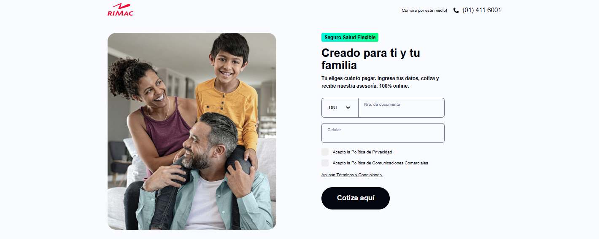

<div align="center">

# RIMAC Frontend Challenge



Este proyecto es una prueba tecnica organizada por la empresa Softtek. El objetivo es desarrollar una aplicación frontend utilizando tecnologías modernas y siguiendo buenas prácticas de desarrollo.

</div>

## Tabla de Contenidos

- [Características](#características)
- [Tecnologías Utilizadas](#tecnologías-utilizadas)
- [Instalación](#instalación)
- [Uso](#uso)

## Características

- **Desarrollo con React.js**: Utiliza la biblioteca de React para construir una interfaz de usuario dinámica y escalable.
- **Consumo de APIs**: Consume datos de APIs proporcionadas para usuarios y planes.
- **Componentes Reutilizables**: Se han creado varios componentes reutilizables utilizando Sass.
- **Metodología BEM**: Implementa la metodología BEM para organizar los estilos CSS.
- **Diseño Responsive**: La aplicación se adapta a diferentes tamaños de pantalla.
- **Validación de formularios**: Manejo y validación de formularios para mejorar la experiencia del usuario.
- **Código limpio y escalable**: Uso de pincipios SOLID y organizacion de carpetas.

## Tecnologías Utilizadas

Este proyecto fue desarrollado utilizando las siguientes tecnologías:

- **React**: Librería para construir interfaces de usuario.
- **TypeScript**: Lenguaje de programación que agrega tipado a JavaScript.
- **Sass**: Preprocesador CSS que facilita el uso de estilos.
- **Axios**: Para el manejo de peticiones HTTP.
- **Vite**: Herramienta de construcción y desarrollo rápido.
- **Git**: Control de versiones.

### Dependencias

Las principales dependencias del proyecto son:

```json
{
  "dependencies": {
    "axios": "^1.7.7",
    "react": "^18.3.1",
    "react-dom": "^18.3.1",
    "react-router-dom": "^6.26.2"
  },
  "devDependencies": {
    "@eslint/js": "^9.9.0",
    "@types/react": "^18.3.3",
    "@types/react-dom": "^18.3.0",
    "@vitejs/plugin-react": "^4.3.1",
    "eslint": "^9.9.0",
    "eslint-plugin-react-hooks": "^5.1.0-rc.0",
    "eslint-plugin-react-refresh": "^0.4.9",
    "globals": "^15.9.0",
    "sass": "^1.79.4",
    "sass-loader": "^16.0.2",
    "typescript": "^5.5.3",
    "typescript-eslint": "^8.0.1",
    "vite": "^5.4.1"
  }
}
```

## Instalación

Para instalar y ejecutar este proyecto en tu máquina local, sigue estos pasos:

1. Clona el repositorio:

   ```bash
   git clone https://github.com/bgalvandev/rimac-frontend-challenge.git
   ```

2. Cambia al directorio del proyecto:

   ```bash
   cd rimac-frontend-challenge
   ```

3. Instala las dependencias:

   ```bash
   npm install
   ```

4. Crea un archivo `.env.local` a partir de `.env.template` y configura las variables necesarias.

5. Ejecuta la aplicación:
   ```bash
   npm run dev
   ```

## Uso

La aplicación cuenta con tres secciones principales:

1. Inicio - Formulario: En la pantalla de inicio, encontrarás un formulario donde debes ingresar tu **DNI/CE**, **Número de Documento** y **Celular**. Estos campos son obligatorios y se validan al enviar el formulario.

2. Planes - Selección de Planes: Una vez que completes el formulario, serás dirigido a la sección de **Planes**. Aquí podrás elegir entre diferentes opciones de planes.

3. Resumen - Resumen de Información: En la página de resumen, podrás ver toda la información ingresada y los detalles del plan elegido:
